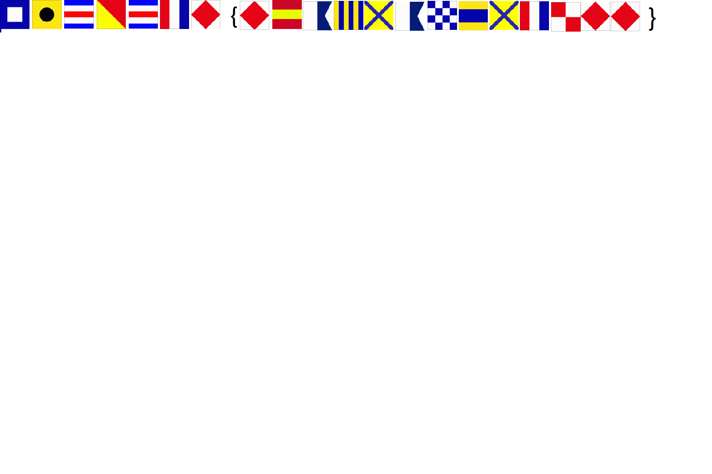

# Flags

## Question
What do the flags mean?

## Solution
The given file:

We would guest the first 7 flags represents "PICOCTF". After googling "flag cipher", we found something called "International Code of Signals maritime flags". In particular, the flags here are using the [US Navy version instead of the international one](http://www.quadibloc.com/other/images/signal4.gif). Decrypting the flags here, it would be `PICOCTF{F1AG5AND5TUFF}`.